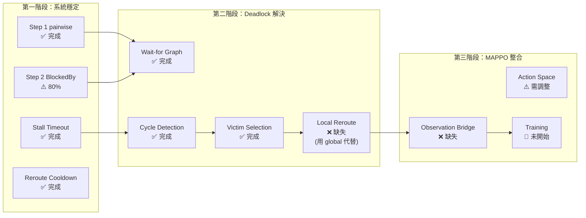

# 論文框架可行性報告：discuss.md vs 當前 RAWSim-O 實作

## 1. 框架概述

discuss.md 提出了一個 **conflict-aware hierarchical routing framework**，核心主張：

> 不要讓 RL 直接解 triple conflict。用 graph 表示多方衝突 → 規則層打破死鎖 → RL 只學局部偏好。

具體分為 **Layer A（RL 決策層）** 和 **Layer B（Traffic Resolution 層）**，後者由 5 個 Step 組成。

---

## 2. 逐項對照：框架 vs 現有實作

### Step 1：保留 pairwise speedCap

| 項目 | 框架要求 | 現狀 |
|------|---------|------|
| pairwise 碰撞避免 | 保留現有 TrafficArbiter | ✅ 保留，未刪除 |
| 批次一致性 | 未明確要求 | ✅ 已實作 `PrecomputeAll()`，消除 sequential update 不一致 |

> [!NOTE]
> 框架沒有提到「sequential update 不一致」這個問題，但我們的實作超前解決了。`PrecomputeAll` 確保所有 bot 在同一個 tick 看到同一世界快照。

**結論：✅ 完全滿足，且超出框架要求。**

---

### Step 2：蒐集「誰因誰而停」

| 項目 | 框架要求 | 現狀 |
|------|---------|------|
| `BlockedBy` | 記錄阻擋者 | ✅ 已實作（[BotNormal.cs:L266](file:///c:/Users/Aesop/Desktop/rawsim-o-rmfs-world-models/RAWSimO.Core/Bots/BotNormal.cs#L266)） |
| `WaitTicks` | 記錄等待時間 | ✅ 已實作（[BotNormal.cs:L268](file:///c:/Users/Aesop/Desktop/rawsim-o-rmfs-world-models/RAWSimO.Core/Bots/BotNormal.cs#L268)） |
| `BlockedReason` | 區分阻擋原因 | ❌ 未實作 |
| `DesiredWaypoint` | 記錄想去的 waypoint | ❌ 未實作（bot 有 `NextWaypoint` 但不是框架要的 `DesiredWaypoint`） |
| 8 處 BlockedBy 賦值 | 每個 break/min 點都設 | ✅ 已實作（TrafficArbiter 8 個位置） |

> [!WARNING]
> **Gap：`BlockedReason` 未實作。**
>
> 框架建議區分 `ConflictAtWaypoint`、`HeadOn`、`Occupancy` 等原因。
> 目前只知道「被誰擋」，不知道「為什麼被擋」。
> 這對 MAPPO 的 observation 設計有影響——RL 需要知道衝突類型才能學到針對性策略。

**結論：⚠️ 核心邏輯滿足（BlockedBy + WaitTicks），但缺 BlockedReason 和 DesiredWaypoint 元資訊。**

---

### Step 3：Wait-for Graph + Cycle Detection

| 項目 | 框架要求 | 現狀 |
|------|---------|------|
| 建等待圖（A→B 邊） | 每 N tick 建 | ✅ 已實作（[TrafficArbiter.cs:L453](file:///c:/Users/Aesop/Desktop/rawsim-o-rmfs-world-models/RAWSimO.Core/Control/TrafficArbiter.cs#L453)） |
| 頻率控制 | 每 3~5 tick | ✅ `CYCLE_DETECTION_INTERVAL = 5` |
| 圖資料結構 | `Dictionary<Bot, List<Bot>>` | ✅ `Dictionary<BotNormal, BotNormal>`（出度 ≤1，更輕量） |
| Cycle detection | DFS / Tarjan | ✅ 路徑追蹤法（O(N)，利用出度 ≤1 特性） |

> [!TIP]
> 框架建議用 `List<BotNormal>` 允許多對一阻擋關係。
> 我們的實作簡化為 `BotNormal`（單一 blocker），因為 `ComputeSpeedCap` 中 `break` 語句只保留了「最終生效的阻擋者」。
>
> 這實際上是 **更正確的**——在 wait-for graph 中，一個 bot 真正在等的只有那個最終讓它停下的 bot，不是所有附近的 bot。

**結論：✅ 完全滿足，且演算法設計合理。**

---

### Step 4 & 5：Cycle Resolution（選 loser + 局部退讓）

| 項目 | 框架要求 | 現狀 |
|------|---------|------|
| 選 loser | 環中最低優先者 | ✅ `ComputeDynamicPriority` with Phase + Direction + Aging + ID |
| 只處罰一台 | 不要全部 reroute | ✅ 只選一個 loser |
| Aging 防飢餓 | `WaitTime` 參與排序 | ✅ `score += Math.Min(bot.WaitTicks, 200)` |
| Reroute cooldown | 防震盪 | ✅ `REROUTE_COOLDOWN = 2.0` 秒 |
| **Local reroute** | 退到 safe waypoint，不是 global reroute | ⚠️ **使用 `RequestReoptimization`（全路徑重算）** |

> [!IMPORTANT]
> **關鍵 Gap：Local Reroute vs Global Reroute**
>
> 框架明確強調（L376-401）：
> - 不要每次死鎖都重跑整條 A*
> - 應該只做「退到最近 turn point」或「進入 waiting node」
> - 這叫 local reroute
>
> 但我們目前用的是 `RequestReoptimization = true`，這會觸發 [AgentAStar PathManager](file:///c:/Users/Aesop/Desktop/rawsim-o-rmfs-world-models/RAWSimO.Core/Control/Defaults/PathPlanning/AgentAStar/BotAStarPlanner.cs#L59-L63) 的完整路徑重算。
>
> **這不是 local reroute，這是 global reroute。**
>
> 在高密度場景下，頻繁 global reroute 可能導致框架擔心的 **path oscillation**（L520-540）。
> 我們有 `REROUTE_COOLDOWN = 2.0` 秒作為緩衝，但這只限制了頻率，沒有限制 scope。

**結論：⚠️ 核心邏輯正確（選 loser + cooldown），但 reroute 粒度過粗。**

---

### Stall Timeout

| 項目 | 框架要求 | 現狀 |
|------|---------|------|
| 速度極低偵測 | `speedCap < eps` | ✅ `speedCap <= 0.01` |
| 排除 station | `!IsProcessingAtStation` | ✅ `StationEnterTime < 0` |
| 排除 pickup/dropoff | `!IsLoadingOrUnloading` | ⚠️ 未顯式排除（但 `BlockedBy != null` 間接篩掉，因為 station 操作不會有 BlockedBy） |
| 只計 traffic stall | `IsBlockedByTraffic` | ✅ 已實作 |
| Timeout 門檻 | 可配置 | ✅ `STALL_TIMEOUT = 3.0` 秒 |
| Cooldown | 防重複觸發 | ✅ `REROUTE_COOLDOWN = 2.0` 秒 |

> [!NOTE]
> 框架擔心的「正常排隊被誤判」問題（L234-254），我們透過 `BlockedBy != null && StationEnterTime < 0` 兩個條件有效過濾了。
> 正常排隊（等前車慢速通行）如果前車也在移動，`speedCap` 不會降到 0，所以不會觸發。
> 但如果前車也被堵住了（連鎖煞車），確實會觸發——這正是我們想處理的情況。

**結論：✅ 完全滿足框架要求。**

---

### Layer A：MAPPO 整合

| 項目 | 框架要求 | 現狀 |
|------|---------|------|
| Observation 加衝突特徵 | is_blocked, blocker_phase, wait_time, in_cycle | ❌ **未實作** |
| Action space 精簡 | keep / yield / request_local_reroute / stop | ⚠️ 目前是 `MultiDiscrete([5, 3, 3])`，和框架不完全對應 |
| RL 不直接解多方協商 | 交給規則層 | ✅ 架構設計正確——PrecomputeAll + CycleDetection 是規則層 |

> [!IMPORTANT]
> **最大的 Gap：MAPPO Observation Bridge**
>
> 目前 GymServer（[BotCameraRenderer.cs](file:///c:/Users/Aesop/Desktop/rawsim-o-rmfs-world-models/RAWSimO.GymServer/BotCameraRenderer.cs)）只傳送 **圖像觀測**（64×64×3 pixel image）。
>
> 框架要求的衝突特徵（is_blocked, blocker_phase, local_conflict_count, is_in_cycle）
> **目前完全沒有管道傳到 Python 端**。
>
> 這些特徵存在於 C# 側的 `BotNormal` 物件上，但 GymServer 的 protocol
> ([GymProtocol.cs](file:///c:/Users/Aesop/Desktop/rawsim-o-rmfs-world-models/RAWSimO.GymServer/GymProtocol.cs))
> 沒有序列化這些欄位到 observation。
>
> 要完成框架的第三階段整合，需要：
> 1. 在 GymServer 序列化 `is_blocked`, `blocker_phase`, `WaitTicks`, `is_in_cycle` 等特徵
> 2. 在 Python 端修改 `observation_space` 從純 `Box(image)` 變成 `Dict(image + vector)`
> 3. 修改 MAPPO 的 model 接入 vector features

**結論：❌ 第三階段（MAPPO 整合）的基礎設施尚未就緒。**

---

### 短視野 Reservation（discuss.md 第二個核心機制）

| 項目 | 框架要求 | 現狀 |
|------|---------|------|
| 1-step waypoint reservation | `waypoint → current_owner, next_claimers` | ⚠️ 部分存在 |
| ClaimWaypoint 機制 | 多人 claim 同一 WP 時按優先級排序 | ⚠️ 存在但未充分利用 |

> [!NOTE]
> Controller 裡已有 `ClaimWaypoint` / `ReleaseWaypoint`（[Controller.cs:L194-211](file:///c:/Users/Aesop/Desktop/rawsim-o-rmfs-world-models/RAWSimO.Core/Control/Controller.cs#L194-L211)），但目前：
> - 只做 binary claim（第一個來的人拿到）
> - 沒有 priority-based arbitration
> - 且在 snap zone 被禁用了（[BotNormal.cs:L1024](file:///c:/Users/Aesop/Desktop/rawsim-o-rmfs-world-models/RAWSimO.Core/Bots/BotNormal.cs#L1024) 註解說明了原因）
>
> 框架建議的 `next_claimers` 多人競爭機制尚未實作。
> 不過，`PrecomputeAll` 的 batch arbitration 已經在功能上實現了類似效果：
> 它先統一計算誰能通過、誰不能，等同於「在計算層面做了 reservation」。

**結論：⚠️ 功能上部分覆蓋（PrecomputeAll 代替了顯式 reservation），但架構上沒有遵循框架建議的 claim table。**

---

## 3. 風險分析

### Risk 1：Global Reroute 造成 Path Oscillation（嚴重度：高）

`RequestReoptimization` 會讓 PathManager 重算整條路徑。在高密度場景：
- Loser 被 reroute → 新路徑可能和其他 bot 衝突 → 觸發新的 deadlock → 又被選為 loser → 再 reroute
- `REROUTE_COOLDOWN = 2.0` 秒只能限制頻率，不能限制 scope
- **框架明確警告了這一點（L520-540）**

**緩解方案：** 實作 local reroute——不重算整條路，只退到最近 intersection/turn point。

### Risk 2：FCFS 動態判斷造成 BlockedBy 翻轉（嚴重度：中）

`ComputeSpeedCap` 中的 FCFS 邏輯（[TrafficArbiter.cs:L270-L278](file:///c:/Users/Aesop/Desktop/rawsim-o-rmfs-world-models/RAWSimO.Core/Control/TrafficArbiter.cs#L270-L278)）基於 `EstimateArrivalTime`：
- 到達時間是 tick-by-tick 動態計算的
- 上一 tick robot A 可能因為減速導致 arrival time 變晚
- 這一 tick FCFS 判斷可能讓 A 從 winner 變成 loser
- `BlockedBy` 隨之翻轉 → wait-for graph 結構不穩定

**緩解方案：** 在 `PrecomputeAll` 中，如果 bot 的 BlockedBy 連續 N tick 指向同一個 bot，才納入 cycle detection。避免暫態翻轉觸發假陽性。

### Risk 3：觀測通道斷裂（嚴重度：高，對第三階段）

目前 C# 端已有完整的衝突追蹤資料（BlockedBy、WaitTicks、IsBlockedByTraffic），但這些資料無法到達 Python 端的 MAPPO。GymServer 只傳圖像，沒有 vector observation 通道。

**緩解方案：** 在 GymServer 的 step response 中加 JSON 欄位，攜帶 per-bot conflict features。

### Risk 4：Cycle Detection 偵測不到所有死鎖（嚴重度：中）

`DetectAndResolveCycles` 只在 `IsBlockedByTraffic == true` 的 bot 之間建邊。如果一個 bot 雖然被減速但沒有完全停住（`speedCap = 0.03`），它不會被納入 wait-for graph，即使它事實上在緩慢循環等待。

**緩解方案：** 將閾值從 `0.01` 提高到 `0.05`，或加入「速度低於 MaxSpeed×10% 持續 2 秒以上」的條件。

---

## 4. 實作完成度矩陣

| 框架項目 | 完成度 | 優先修復 |
|---------|--------|---------|
| Pairwise speedCap | 100% | — |
| Batch precompute | 100% | — |
| BlockedBy 追蹤 | 80% | 缺 BlockedReason |
| Stall timeout | 100% | — |
| Reroute cooldown | 100% | — |
| Wait-for graph | 100% | — |
| Cycle detection | 100% | — |
| Victim selection (aging) | 100% | — |
| **Local reroute** | **0%** | **高優先** |
| **1-step reservation** | **30%** | 中（PrecomputeAll 部分替代） |
| **Observation bridge** | **0%** | 第三階段必備 |
| Action space 匹配 | 60% | 第三階段調整 |

---

## 5. 結論與建議

### 框架可行嗎？

**整體可行。** discuss.md 的三層架構（pairwise → wait-for graph → MAPPO 整合）設計合理，且第一階段和第二階段的核心已落地。最大的兩個缺口：

1. **Local Reroute 機制完全缺失** — 這是框架最強調的、也是防止 oscillation 的關鍵。目前用 global `RequestReoptimization` 代替，在低密度場景可能沒問題，但高密度場景會暴露。

2. **MAPPO Observation Bridge 未建立** — 衝突資料只在 C# 物件上，Python 端看不到。這阻擋了框架的第三階段。

### 建議的 Next Steps（優先序）

1. **先跑模擬測試**：用現有實作（global reroute + cycle detection）跑一次完整模擬。觀察：
   - 是否有 `[TrafficArbiter] Deadlock cycle` 日誌輸出？
   - 是否有 `[StallTimeout]` 日誌輸出？
   - Reroute 是否導致 oscillation？

2. **如果 oscillation 明顯** → 實作 local reroute：
   - 在 waypoint graph 上標記 turn point / intersection
   - Loser 不重算全路徑，只退到最近 turn point
   - 需要一個新的 `RequestLocalReroute` flag 和 PathManager 的輕量 replan 邏輯

3. **如果 observation 整合成為瓶頸** → 擴展 GymServer protocol：
   - Step response 加 per-bot conflict vector
   - Python 端改 `observation_space` 為 `Dict`

4. **補 BlockedReason** → 在 `ComputeSpeedCap` 的 8 個 BlockedBy 賦值點加 enum 值，區分 HeadOn / SameNextWP / Occupancy
